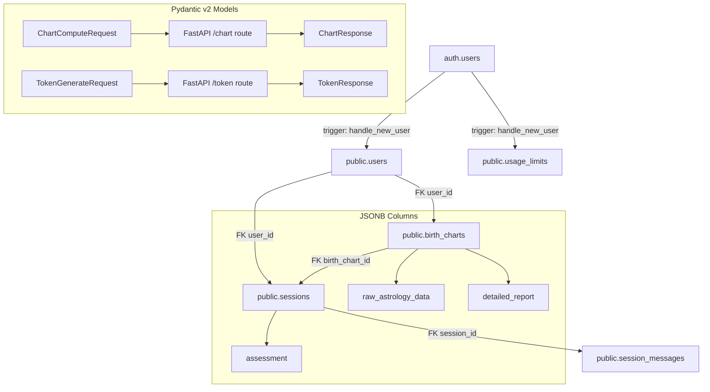

# Design Document — Phase 1: Database & Data Schemas

## Overview

This phase rewrites two files to establish a clean Western Tropical Astrology foundation for JyotishAI v2:

1. `jyotishai/backend/supabase-schema.sql` — Full PostgreSQL schema with no Vedic columns, explicit RLS policies, and all triggers.
2. `jyotishai/backend/app/models/schemas.py` — Pydantic v2 models that mirror the JSONB structures in the schema.

The existing schema has Vedic-specific columns (`nakshatra`, `mahadasha`, `yogas`, `ascendant`, `sun_sign`, `moon_sign`) that are incompatible with the v2 Western-only product direction. The existing `schemas.py` has outdated models (`BirthChartResponse` with Vedic fields, no sub-models for JSONB). Both files are fully replaced.

---

## Architecture



---

## Components and Interfaces

### SQL Schema Components

#### Extensions
- `uuid-ossp` — provides `uuid_generate_v4()` as a fallback.
- `pgcrypto` — provides `gen_random_uuid()` used as the default for primary keys.

#### Tables

| Table | Key Change from v1 |
|---|---|
| `public.users` | `full_name` and `email` become nullable (no NOT NULL) to match spec; `gender` loses CHECK constraint |
| `public.birth_charts` | All Vedic columns removed; `planets`/`houses` standalone columns removed; `raw_astrology_data JSONB NOT NULL` and `detailed_report JSONB NOT NULL` added |
| `public.sessions` | `livekit_room TEXT NOT NULL UNIQUE` enforced; `summary TEXT` replaced by `assessment JSONB`; `duration_secs INT DEFAULT 0` (was nullable) |
| `public.session_messages` | Unchanged structure, RLS policy explicitly restated |
| `public.usage_limits` | Unchanged structure, RLS policy explicitly restated |

#### Triggers
- `users_updated_at` — fires `BEFORE UPDATE` on `public.users`, sets `updated_at = NOW()`.
- `on_auth_user_created` — fires `AFTER INSERT` on `auth.users`, inserts into `public.users` and `public.usage_limits`.

#### RLS Policies (one per table, covering all operations)

| Table | Policy Name | Condition |
|---|---|---|
| `public.users` | `users_own_row` | `auth.uid() = id` |
| `public.birth_charts` | `charts_own_rows` | `auth.uid() = user_id` |
| `public.sessions` | `sessions_own_rows` | `auth.uid() = user_id` |
| `public.session_messages` | `messages_via_session` | EXISTS subquery on `public.sessions` |
| `public.usage_limits` | `usage_own_row` | `auth.uid() = user_id` |

---

### Pydantic v2 Model Components (`schemas.py`)

#### Sub-models (JSONB structure enforcement)

```
RawAstrologyData
├── planets: Dict[str, PlanetDetails]   # keys: sun, moon, mercury, venus, mars, jupiter, saturn, uranus, neptune, pluto
├── houses: Dict[str, HouseDetails]     # keys: "1" through "12"
└── angles: Dict[str, AngleDetails]     # keys: ascendant, midheaven

DetailedReport
├── personal: TimelineReport
├── career: TimelineReport
└── love: TimelineReport

TimelineReport
├── past: str
├── current: str
└── future: str

SessionAssessment
├── session_summary: str
├── key_insights: List[str]
└── action_items: List[str]
```

#### Top-level request/response models

| Model | Direction | Route |
|---|---|---|
| `ChartComputeRequest` | Request | `POST /chart/compute` |
| `ChartResponse` | Response | `POST /chart/compute` |
| `TokenGenerateRequest` | Request | `POST /token/generate` |
| `TokenResponse` | Response | `POST /token/generate` |

---

## Data Models

### `raw_astrology_data` JSONB structure

```json
{
  "planets": {
    "sun":     { "sign": "Taurus",   "degree": 21.4, "house": 9,  "is_retrograde": false },
    "moon":    { "sign": "Aquarius", "degree": 18.2, "house": 6,  "is_retrograde": false },
    "mercury": { "sign": "Gemini",   "degree": 5.1,  "house": 10, "is_retrograde": false },
    "venus":   { "sign": "Aries",    "degree": 14.7, "house": 8,  "is_retrograde": false },
    "mars":    { "sign": "Virgo",    "degree": 3.3,  "house": 1,  "is_retrograde": true  },
    "jupiter": { "sign": "Scorpio",  "degree": 22.0, "house": 3,  "is_retrograde": false },
    "saturn":  { "sign": "Capricorn","degree": 8.9,  "house": 5,  "is_retrograde": false },
    "uranus":  { "sign": "Capricorn","degree": 11.2, "house": 5,  "is_retrograde": false },
    "neptune": { "sign": "Capricorn","degree": 14.5, "house": 5,  "is_retrograde": false },
    "pluto":   { "sign": "Scorpio",  "degree": 19.8, "house": 3,  "is_retrograde": false }
  },
  "houses": {
    "1":  { "sign": "Leo",       "degree": 11.2 },
    "2":  { "sign": "Virgo",     "degree": 3.3  },
    "12": { "sign": "Cancer",    "degree": 18.0 }
  },
  "angles": {
    "ascendant": { "sign": "Leo",    "degree": 11.2 },
    "midheaven": { "sign": "Taurus", "degree": 9.1  }
  }
}
```

### `detailed_report` JSONB structure

```json
{
  "personal": { "past": "...", "current": "...", "future": "..." },
  "career":   { "past": "...", "current": "...", "future": "..." },
  "love":     { "past": "...", "current": "...", "future": "..." }
}
```

### `assessment` JSONB structure

```json
{
  "session_summary": "User explored career transitions and relationship patterns.",
  "key_insights": ["Saturn in 5th suggests disciplined creativity", "Venus-Mars tension in chart"],
  "action_items": ["Reflect on creative outlets", "Journal about relationship patterns"]
}
```

---

## Error Handling

- The SQL schema uses `IF NOT EXISTS` guards on extensions and `CREATE OR REPLACE` on functions to make the script safely re-runnable.
- Pydantic v2 models use strict typing — invalid payloads will raise `ValidationError` automatically, which FastAPI converts to a 422 response.
- `uuid.UUID` fields in Pydantic will reject malformed UUIDs at parse time.
- `datetime.date` and `datetime.time` fields will reject invalid date/time strings at parse time.

---

## Testing Strategy

- The SQL schema is validated by applying it to a fresh Supabase project and confirming all tables, indexes, triggers, and RLS policies are created without errors.
- Pydantic models are validated by unit tests that instantiate each model with valid and invalid data, confirming correct parsing and rejection behavior.
- Integration is confirmed by running the FastAPI backend and hitting `/chart/compute` and `/token/generate` with sample payloads, verifying the request models parse correctly and the response models serialize correctly.
