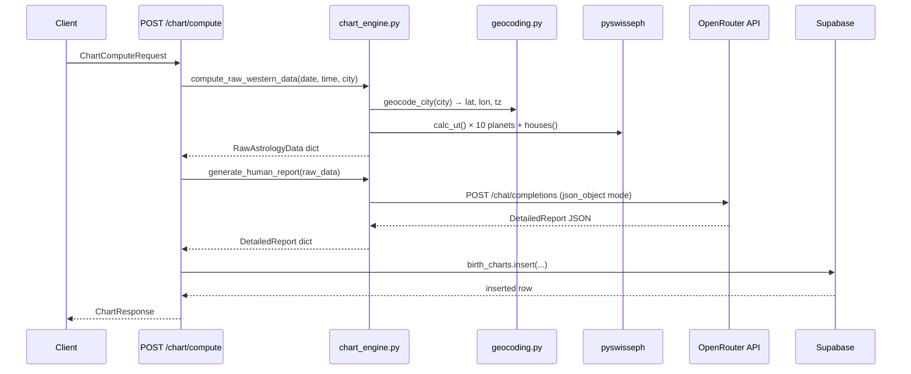

# Design Document — Phase 3: OpenRouter Translation Engine

## Overview

Phase 3 replaces the existing Vedic-oriented chart engine and router with a fully Western Tropical pipeline. The two-stage pipeline is:

1. **Ephemeris stage** — synchronous, CPU-bound: geocode the birth city, then use pyswisseph (Placidus, tropical) to compute planetary longitudes, house cusps, and angles.
2. **AI stage** — async, I/O-bound: serialize the raw data and POST it to OpenRouter (`gpt-4o-mini`) to receive a structured conversational report.

The router orchestrates both stages, persists the result to Supabase, and returns a validated `ChartResponse`.

---

## Architecture



---

## Components and Interfaces

### `chart_engine.py`

#### `compute_raw_western_data(birth_date, birth_time, city) -> dict`

Synchronous. Calls `geocode_city` then runs pyswisseph.

- Sets `swe.set_sid_mode(swe.SIDM_FAGAN_BRADLEY, 0, 0)` then uses `swe.FLG_SPEED` only (no `FLG_SIDEREAL`) — this is the correct way to force tropical mode in pyswisseph.
- Computes 10 planets: Sun, Moon, Mercury, Venus, Mars, Jupiter, Saturn, Uranus, Neptune, Pluto.
- Calls `swe.houses(jd, lat, lon, b'P')` for Placidus cusps.
- Determines each planet's house by iterating cusps and finding which cusp range the planet's longitude falls in.
- Returns a dict shaped exactly like `RawAstrologyData`:

```python
{
  "planets": {
    "sun": {"sign": "Taurus", "degree": 21.4, "house": 9, "is_retrograde": False},
    ...  # 10 planets total
  },
  "houses": {
    "1": {"sign": "Leo", "degree": 11.2},
    ...  # keys "1" through "12"
  },
  "angles": {
    "ascendant": {"sign": "Leo", "degree": 11.2},
    "midheaven": {"sign": "Taurus", "degree": 9.1}
  },
  "_meta": {
    "latitude": 19.076,
    "longitude": 72.877,
    "timezone": "Asia/Kolkata"
  }
}
```

The `_meta` key carries geocoding results for the router to extract `latitude`, `longitude`, and `timezone` without a second geocoding call. It is stripped before passing to OpenRouter.

#### `generate_human_report(raw_data: dict) -> dict` (async)

- Strips `_meta` from `raw_data` before serializing into the prompt.
- Returns fallback dict immediately if `settings.OPENROUTER_API_KEY` is falsy.
- Uses `httpx.AsyncClient` with `timeout=30.0`.
- Sends to `https://openrouter.ai/api/v1/chat/completions` with model `openai/gpt-4o-mini`, `temperature=0.7`, and `response_format: {"type": "json_object"}`.
- On success: parses `choices[0].message.content` as JSON and returns it.
- On any failure: returns a safe fallback dict (all nine string fields non-empty).

### `routers/chart.py`

Single endpoint: `POST /chart/compute` (status 201).

- Accepts `ChartComputeRequest` (no auth dependency — auth is handled at middleware level per existing `main.py` setup; the `user_id` is supplied in the request body per the schema).
- Calls `compute_raw_western_data`, extracts `_meta` for lat/lon/tz, then calls `generate_human_report`.
- Builds `db_payload` and inserts into `birth_charts`.
- Returns `ChartResponse`.

Retains the existing `GET /user/{user_id}` and `GET /{chart_id}` read endpoints unchanged.

### `db/supabase.py`

Adds a `get_supabase_client()` function that returns the existing module-level `supabase` singleton. This satisfies Requirement 4 without breaking any existing imports.

---

## Data Models

All Pydantic models are already defined in `schemas.py` (Phase 2). No changes needed.

Key shapes referenced:

| Model | Fields |
|---|---|
| `RawAstrologyData` | `planets: Dict[str, PlanetDetails]`, `houses: Dict[str, HouseDetails]`, `angles: Dict[str, AngleDetails]` |
| `DetailedReport` | `personal`, `career`, `love` — each a `TimelineReport(past, current, future)` |
| `ChartComputeRequest` | `full_name`, `birth_date`, `birth_time`, `birth_city`, `gender`, `user_id` |
| `ChartResponse` | `chart_id`, `full_name`, `raw_astrology_data`, `detailed_report`, `message` |

---

## Error Handling

| Failure point | Behaviour |
|---|---|
| City not found (geocoding) | `ValueError` caught → HTTP 400 |
| pyswisseph exception | Generic `Exception` caught → HTTP 500 |
| OpenRouter key missing | Immediate fallback dict returned (no exception) |
| OpenRouter non-200 response | Fallback dict returned (logged internally) |
| OpenRouter network timeout / exception | Fallback dict returned |
| Supabase insert returns empty data | HTTP 500 with descriptive message |

The fallback dict ensures the endpoint always returns a valid `ChartResponse` even when OpenRouter is unavailable, degrading gracefully.

---

## Testing Strategy

- **Unit — `compute_raw_western_data`:** Provide a known birth date/city (e.g., 1990-05-01, New York) and assert the returned dict has all 10 planets, 12 house keys, and both angle keys, with degrees in range 0–30 and house numbers 1–12.
- **Unit — `generate_human_report` fallback:** Call with `settings.OPENROUTER_API_KEY = ""` and assert the returned dict has all nine string fields non-empty.
- **Unit — `generate_human_report` success path:** Mock `httpx.AsyncClient.post` to return a 200 response with a valid JSON body; assert the parsed dict is returned.
- **Integration — `POST /chart/compute`:** Use FastAPI `TestClient` with mocked `compute_raw_western_data` and `generate_human_report`; assert HTTP 201 and a valid `ChartResponse` body.
