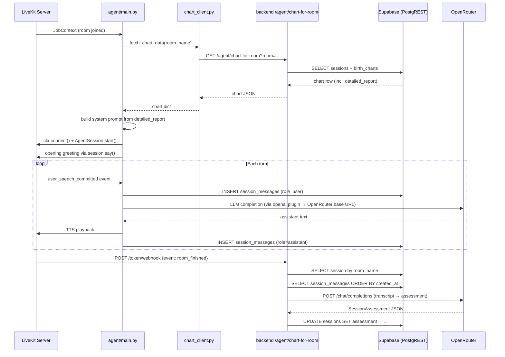

# Design Document — Phase 5: LiveKit Voice Agent & Post-Chat Summary

## Overview

Phase 5 has two tightly coupled concerns:

1. **Agent repair and upgrade** — `agent/main.py` currently references symbols that do not exist in the installed `livekit-agents==1.5.x` package (`inference.STT`, `sarvam.TTS`, `MultilingualModel`, `VoicePipelineAgent`). The file must be rewritten to use the correct v1.x API (`AgentSession` + `Agent`) while wiring Celeste's system prompt to the `detailed_report` narrative blocks from the database.

2. **Post-session assessment** — When a LiveKit room finishes, the existing webhook handler in `backend/app/routers/token.py` only marks the session as ended. It must be extended to compile the transcript from `public.session_messages`, call OpenRouter, and write a structured `SessionAssessment` JSON back to `public.sessions.assessment`.

No new tables or schema changes are required — all columns (`session_messages`, `sessions.assessment`) were defined in Phase 1.

---

## Architecture



---

## Components and Interfaces

### 1. `agent/chart_client.py` — `fetch_chart_data`

The existing file exposes `fetch_chart_for_room` and `build_chart_context`. The agent spec requires a function named `fetch_chart_data`. Rather than breaking the existing interface, we add `fetch_chart_data` as an alias/wrapper that calls the existing `fetch_chart_for_room` and returns the raw dict (the agent only needs the dict, not the formatted string).

```python
async def fetch_chart_data(room_name: str) -> dict:
    result = await fetch_chart_for_room(room_name)
    return result or {}
```

This is the minimal change — no existing callers are broken.

### 2. `agent/main.py` — Full rewrite

**Key API corrections for livekit-agents v1.5.x:**

| Old (broken) | New (correct) |
|---|---|
| `from livekit.agents import llm` then `llm.VoicePipelineAgent` | `from livekit.agents import AgentSession, Agent` |
| `inference.STT(...)` | `deepgram.STT(model="nova-2-general")` |
| `inference.LLM(...)` | `openai.LLM(model="openai/gpt-4o-mini")` pointed at OpenRouter base URL |
| `sarvam.TTS(...)` | `elevenlabs.TTS(voice_id="EXAVITQu4vr4xnSDxMaL")` |
| `MultilingualModel()` | `silero.VAD.load()` |
| `session.start(room=..., agent=..., room_input_options=...)` | `await session.start(room=ctx.room, agent=JyotishAgent(...))` |
| `event.transcript` in speech hooks | `event.transcript` (same, but event type is `AgentTranscriptionEvent`) |

**OpenRouter routing for the LLM plugin:**  
The `openai.LLM` plugin accepts a `base_url` parameter. Setting it to `https://openrouter.ai/api/v1` and passing the OpenRouter API key as `api_key` routes all LLM calls through OpenRouter without any custom HTTP layer.

**System prompt construction:**  
The prompt embeds `json.dumps(chart_data.get("detailed_report", {}), indent=2)` so Celeste has the exact narrative text the user sees on their dashboard. Raw degree/house data is intentionally excluded from the prompt.

**Message persistence:**  
The Supabase client is instantiated once inside `entrypoint` using the env vars. The `session_id` is resolved by querying `public.sessions` for the room name. Both `user_speech_committed` and `agent_speech_committed` event handlers insert rows into `public.session_messages`. Failures are caught and logged without crashing the pipeline.

**Agent class:**  
A minimal `JyotishAgent(Agent)` subclass is used to pass the system prompt via `super().__init__(instructions=system_prompt)`, matching the v1.x pattern already present in the existing file.

### 3. `backend/app/routers/token.py` — Webhook extension

The existing `room_finished` handler updates session status and duration. We extend it by calling a new async helper `generate_post_session_assessment(session_id)` after the status update.

**`generate_post_session_assessment` logic:**
1. Query `public.session_messages` for all rows with the given `session_id`, ordered by `created_at`.
2. If no rows, return early (no assessment generated).
3. Build a plain-text transcript string: `"USER: ...\nASSISTANT: ..."`.
4. POST to `https://openrouter.ai/api/v1/chat/completions` with model `openai/gpt-4o-mini`, `response_format: {"type": "json_object"}`, and a prompt that requests the `SessionAssessment` structure.
5. Parse the response into a dict and `UPDATE public.sessions SET assessment = <dict>`.
6. All errors are caught and logged; the webhook always returns `{"received": True}` to LiveKit.

The function is defined in `token.py` itself (not a separate service file) to keep the change minimal and co-located with the webhook handler.

---

## Data Models

No new Pydantic models are needed. `SessionAssessment` is already defined in `backend/app/models/schemas.py`:

```python
class SessionAssessment(BaseModel):
    session_summary: str
    key_insights: List[str]
    action_items: List[str]
```

The assessment is stored as raw JSONB in `public.sessions.assessment` (defined in Phase 1 schema). The webhook handler validates the OpenRouter response against this structure before writing to the database.

---

## Error Handling

| Failure point | Behaviour |
|---|---|
| `fetch_chart_data` returns empty dict | Agent uses generic greeting, session continues |
| Supabase session lookup fails in agent | Warning logged, message persistence skipped, session continues |
| Individual `session_messages` insert fails | Error logged, voice pipeline continues uninterrupted |
| OpenRouter call in webhook times out or returns non-200 | Error logged, `assessment` left as null, webhook returns `{"received": True}` |
| Empty transcript at webhook time | Assessment skipped silently, webhook returns `{"received": True}` |
| Missing env vars at agent startup | Error logged, process exits with non-zero code |

---

## Testing Strategy

- **Unit test `fetch_chart_data`**: mock `httpx.AsyncClient` to verify it calls the correct endpoint and returns an empty dict on non-200.
- **Unit test `generate_post_session_assessment`**: mock Supabase client and `httpx.AsyncClient` to verify transcript assembly, OpenRouter payload shape, and the Supabase update call.
- **Integration smoke test**: start the agent against a local LiveKit dev server with a seeded session and verify `session_messages` rows are created and `sessions.assessment` is populated after room close.
