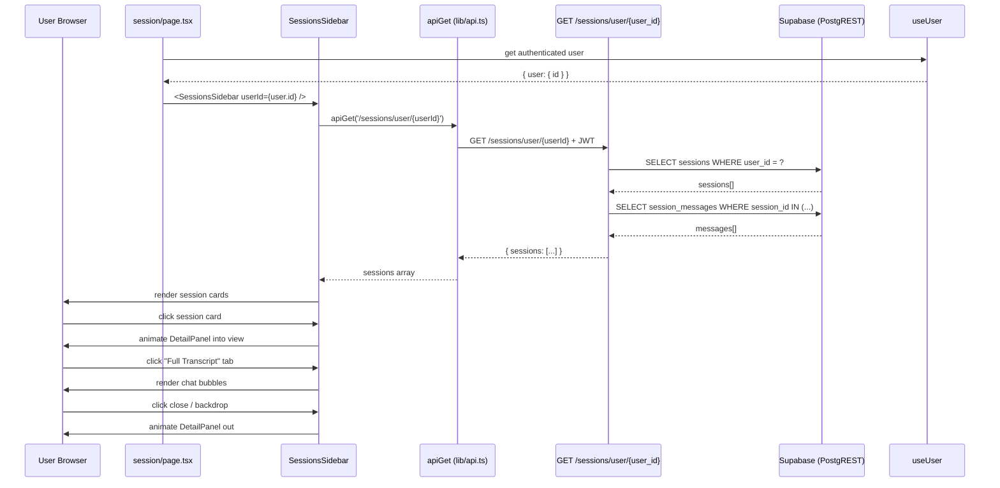

# Design Document — Phase 6: Frontend Historical Sessions Sidebar

## Overview

Phase 6 adds a historical sessions sidebar to the JyotishAI session page. It surfaces past voice consultations stored in `public.sessions` (with their AI-generated `assessment` JSONB and associated `session_messages`) in a scrollable left-column sidebar. Clicking a session card opens a slide-in `DetailPanel` modal with two tabs: AI Assessment and Full Transcript.

Two files are created or modified:

1. **`backend/app/routers/sessions.py`** — new FastAPI router with `GET /sessions/user/{user_id}` that returns sessions with their messages.
2. **`frontend/components/SessionsSidebar.tsx`** — new React client component (sidebar list + detail panel).
3. **`frontend/app/session/page.tsx`** — updated to render `SessionsSidebar` alongside the existing `LiveKitRoom`.

The backend router is registered in the existing FastAPI app. The frontend uses the existing `apiGet` utility and `useUser` hook — no new auth infrastructure is needed.

---

## Architecture



---

## Components and Interfaces

### 1. Backend — `backend/app/routers/sessions.py`

New router registered at prefix `/sessions`.

**Endpoint:** `GET /sessions/user/{user_id}`

- Requires `get_current_user` dependency (JWT validation).
- Queries `public.sessions` for all rows where `user_id` matches, ordered by `started_at DESC`.
- For each session, queries `public.session_messages` ordered by `created_at ASC`.
- Returns a response shaped as:

```json
{
  "sessions": [
    {
      "id": "uuid",
      "livekit_room": "session_abc_xyz",
      "status": "ended",
      "started_at": "2026-05-22T10:00:00Z",
      "duration_secs": 345,
      "assessment": {
        "session_summary": "...",
        "key_insights": ["..."],
        "action_items": ["..."]
      },
      "messages": [
        { "role": "user", "content": "..." },
        { "role": "assistant", "content": "..." }
      ]
    }
  ]
}
```

- If no sessions exist, returns `{ "sessions": [] }` with 200.
- Assessment may be `null` if the session ended before the webhook completed.

**Registration:** Added to `backend/app/main.py` as `app.include_router(sessions_router, prefix="/sessions")`.

---

### 2. Frontend — `frontend/components/SessionsSidebar.tsx`

Client component (`'use client'`). Props: `{ userId: string }`.

**State:**
- `sessions: Session[]` — fetched list
- `loading: boolean` — fetch in progress
- `error: string | null` — fetch failure message
- `selectedSession: Session | null` — drives DetailPanel visibility
- `activeTab: 'summary' | 'transcript'` — DetailPanel tab state

**Data fetch:** `useEffect` calls `apiGet<{ sessions: Session[] }>('/sessions/user/${userId}')` when `userId` is truthy. Sets `sessions`, clears `loading`, sets `error` on failure.

**Session card:** Renders date (`toLocaleDateString`), duration (`Xm Ys`), and truncated `assessment.session_summary` (or fallback text if null).

**DetailPanel:** Rendered inside `AnimatePresence`. Slides in from the right (`x: 100 → 0`). Backdrop click closes it. Two tabs toggle between summary and transcript views.

**TypeScript interfaces:**

```ts
interface Assessment {
  session_summary: string;
  key_insights: string[];
  action_items: string[];
}

interface Message {
  role: 'user' | 'assistant';
  content: string;
}

interface Session {
  id: string;
  livekit_room: string;
  status: string;
  started_at: string;
  duration_secs: number;
  assessment: Assessment | null;
  messages: Message[];
}
```

---

### 3. Frontend — `frontend/app/session/page.tsx`

The existing page is a client component that uses `useEffect` to fetch LiveKit credentials and renders `<LiveKitRoom>`. It must remain a client component because it uses `useEffect`, `useState`, and `useRouter`.

**Changes:**
- Import `useUser` hook and `SessionsSidebar` component.
- Wrap the existing content in a `flex h-screen w-screen overflow-hidden` container.
- Render `<SessionsSidebar userId={user?.id ?? ''} />` as the left column.
- Wrap the existing `<StarField>` + `<LiveKitRoom>` in a `flex-1` right column div.
- The `SessionsSidebar` fetch guard (`if (userId)`) prevents spurious requests while `user` is still loading.

---

## Data Models

No new database tables or schema changes. All data already exists:

| Table | Columns used |
|---|---|
| `public.sessions` | `id`, `user_id`, `livekit_room`, `status`, `started_at`, `duration_secs`, `assessment` |
| `public.session_messages` | `session_id`, `role`, `content`, `created_at` |

The backend endpoint performs two separate queries (sessions, then messages per session) rather than a JOIN to keep the PostgREST calls simple and avoid N+1 by batching messages in a single `IN` query.

---

## Error Handling

| Failure point | Behaviour |
|---|---|
| `apiGet` throws (network error, 401, 500) | `error` state set, error message shown in sidebar, console.error logged |
| Session `assessment` is null | DetailPanel summary tab shows "Assessment not yet available" message |
| Session `messages` is empty array | DetailPanel transcript tab shows "No transcript available" message |
| `userId` prop is empty string | `useEffect` skips fetch entirely (guarded by `if (userId)`) |
| Backend `user_id` mismatch (JWT sub ≠ path param) | Backend returns 403; frontend shows error state |

---

## Testing Strategy

- **Unit test backend endpoint**: mock Supabase client to verify sessions query, messages batch query, and response shape. Verify 401 when no JWT, 200 with empty array when no sessions.
- **Component test `SessionsSidebar`**: mock `apiGet` to return fixture sessions; assert cards render, DetailPanel opens on click, tabs switch correctly, close button dismisses panel.
- Tests are optional per project conventions and marked with `*` in the task list.
